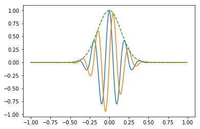
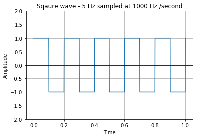
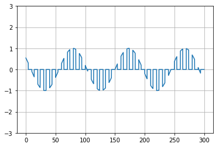

# Waveform generation 

---

An electronic pulse  that has the waveform of a Gaussian distribution( a distribution that resembles a bell curve). 
When the magnitude of the waveform is expressed as a function of time, the Gaussian pulse magnitude, at any time *t*, is given by the following relation 

\\[A_{t} = A_{0} e^{-x} \\]

\\[x = (t/σ)^{2}\\]

- **A0** is the maximum magnitude, 
- **t** is time  
- **σ** is the pulse half-duration 

On a conventional time plot of a Gaussian pulse, the equation yields only the right half of the pulse. The left half is a mirror image, thus producing a curve that nearly looks like a bell when the peaks and ends are slightly rounded. Square waves, pulses with discontinuities, and pulses with nearly instantaneous transitions, i.

---

Let us now look into the gaussian pulse function and generaton of the same 


```python
from scipy import signal
import matplotlib.pyplot as plt
import numpy as np

#Creating a variable t from -1 to 1 
t = np.linspace(-1, 1, 2 * 100, endpoint=False)

# calling the gaussian function 
i, q, e = signal.gausspulse(t, fc=5, retquad=True, retenv=True)
plt.plot(t, i, t, q, t, e, '--')
plt.show()
```





### Generation of Square wave 


```python
from scipy import signal
import matplotlib.pyplot as plot
import numpy as np

# Sampling rate 1000 hz / second
t = np.linspace(0, 1, 1000, endpoint=True)

# Plot the square wave signal
plot.plot(t, signal.square(2 * np.pi * 5 * t))
plot.title('Sqaure wave - 5 Hz sampled at 1000 Hz /second')
plot.xlabel('Time')
plot.ylabel('Amplitude')
plot.grid(True, which='both')
plot.axhline(y=0, color='k')
plot.ylim(-2, 2)
plot.show()
```





## Plusle Amplitude modulation 


```python
import numpy as np
import matplotlib.pyplot as plt

percent=40.0
TimePeriod=10.0
Cycles=30
dt=0.01

t=np.arange(0,Cycles*TimePeriod,dt); 
pwm= (t%TimePeriod) < (TimePeriod*percent/100)

x=np.linspace(-10,10,len(pwm))
y=(np.sin(x))

y[pwm == 0] = 0

plt.plot(t,y)

plt.ylim([-3,3])
plt.grid()
plt.show() 

```





```python

```
